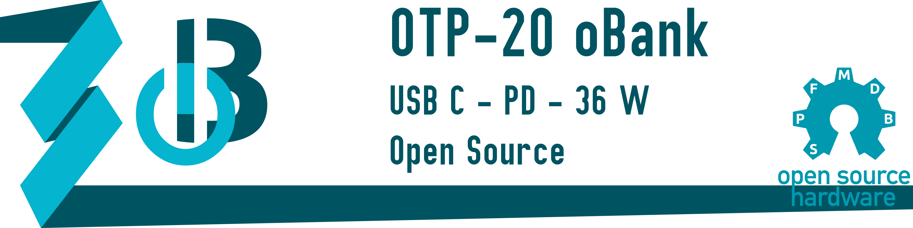

## Overview

---

<table class="left w-100">
    <tr>
        <td class="pr0 tl"><i class="da fa-microchip"></i></td>
        <td><b>Controller:</b></td>
        <td class="tr">STM32L072</td>
    </tr>
    <tr>
        <td class="pr0 tl"><i class="da fa-map-o"></i></td>
        <td><b>Schematics:</b></td>
        <td class="tr">
            <i class="fa fa-check green"></i>
            Available
            <a href="https://github.com/SebastianOberschwendtner/OTP20_oBank/blob/main/02_Schematic/OTP20_oBank_Schematics.pdf" target="_blank">
                here
                <i class="fa fa-external-link"></i>
            </a>
        </td>
    </tr>
    <tr>
        <td class="pr0 tl"><i class="da fa-code"></i></td>
        <td><b>Firmware:</b></td>
        <td class="tr">
            <i class="fa fa-check green"></i>
            Available
            <a href="https://github.com/SebastianOberschwendtner/OTP20_oBank/tree/main/01_Code" target="_blank">
                here
                <i class="fa fa-external-link"></i>
            </a>
        </td>
    </tr>
    <tr>
        <td class="pr0 tl"><i class="da fa-flag-o"></i></td>
        <td><b>Languages:</b></td>
        <td class="tr"><i>C++</i></td>
    </tr>
    <tr>
        <td class="pr0 tl"><i class="da fa-key"></i></td>
        <td><b>License:</b></td>
        <td class="tr"><i>GPL v3</i></td>
    </tr>
    <tr>
        <td class="pr0 tl"><i class="da fa-github"></i></td>
        <td><b>Repository:</b></td>
        <td class="tr">
        <a href="https://github.com/SebastianOberschwendtner/OTP20_oBank" target="_blank">OTP-20 oBank <i class="fa fa-external-link"></i></a>
        </td>
    </tr>
</table>

---

>The **schematic** and **PCB** are designed with *CircuitMaker*. The project can be found [here <i class="fa fa-external-link"></i>](https://circuitmaker.com/Projects/Details/SebastianOberschwendtner/OTP-20oBank).

## Description


This is an open source power bank with USB-C power delivery capabilities.
The power bank is controlled by an STM32L072 microcontroller and features a USB-C port for charging and discharging.
The power bank can be charged with up to 18W and can deliver up to 36W to the connected device.
When connected via the USB-C port, the power bank is compliant with the USB-C power delivery 3.2 standard and automatically negotiates the power delivery profile with the connected device.
In addition, there are two USB-A ports which can deliver up to 2.4A each.
A 3.7V 4000mAh LiPo battery supplies the power bank.
The battery is monitored by a dedicated battery management IC.
A high-contrast OLED display shows the current operating conditions of the power bank and its overall health. 
When the power bank is not in use, it automatically turns off to save power.
The standby current is very low, so that the self-discharge of the battery is negligible during normal everyday use.