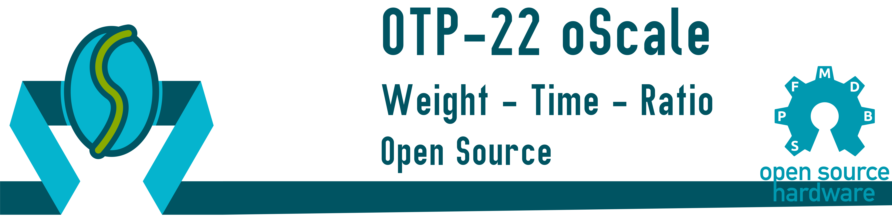

## Overview

---

<table class="left w-100">
    <tr>
        <td class="pr0 tl"><i class="da fa-microchip"></i></td>
        <td><b>Processor:</b></td>
        <td class="tr">Atmel Atmega 328p</td>
    </tr>
    <tr>
        <td class="pr0 tl"><i class="da fa-map-o"></i></td>
        <td><b>Schematics:</b></td>
        <td class="tr">
            <i class="fa fa-check green"></i>
            Available
            <a href="https://github.com/SebastianOberschwendtner/OTP22_oScale/blob/main/02_Schematic/OTP-22_oScale_Schematics_REVA.PDF" target="_blank">
                here
                <i class="fa fa-external-link"></i>
            </a>
        </td>
    </tr>
    <tr>
        <td class="pr0 tl"><i class="da fa-code"></i></td>
        <td><b>Firmware:</b></td>
        <td class="tr">
            <i class="fa fa-check green"></i>
                Available
            <a href="https://github.com/SebastianOberschwendtner/OTP22_oScale/tree/main/01_Code" target="_blank">
                here
                <i class="fa fa-external-link"></i>
            </a>
        </td>
    </tr>
    <tr>
        <td class="pr0 tl"><i class="da fa-flag-o"></i></td>
        <td><b>Languages:</b></td>
        <td class="tr"><i>C++, Python</i></td>
    </tr>
    <tr>
        <td class="pr0 tl"><i class="da fa-key"></i></td>
        <td><b>License:</b></td>
        <td class="tr"><i>GPL v3</i></td>
    </tr>
    <tr>
        <td class="pr0 tl"><i class="da fa-github"></i></td>
        <td><b>Repository:</b></td>
        <td class="tr">
        <a href="https://www.github.com/SebastianOberschwendtner/otp22_oscale" target="_blank">OTP22 oScale <i class="fa fa-external-link"></i></a>
        </td>
    </tr>
</table>

---

>The **schematic** and **PCB** are designed with *CircuitMaker*. The project can be found [here <i class="fa fa-external-link"></i>](https://circuitmaker.com/Projects/Details/SebastianOberschwendtner/OTP-22oScale).

## Description


The *oScale* is a weighing scale with an integrated kitchen timer meant for brewing espresso.
It uses a strain gauge based load cell to measure the weight.