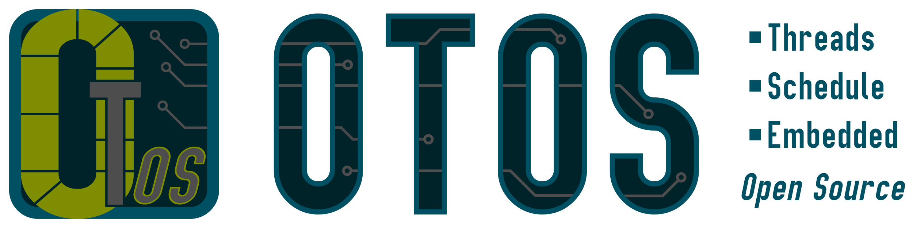

## Overview

---

<table class="left w-100">
    <tr>
        <td class="pr0 tl"><i class="da fa-microchip"></i></td>
        <td><b>Processor:</b></td>
        <td class="tr">ARM Cortex M0+, M4</td>
    </tr>
    <tr>
        <td class="pr0 tl"><i class="da fa-map-o"></i></td>
        <td><b>Schematics:</b></td>
        <td class="tr">
            <i class="fa fa-times dark-red"></i>
            Not Applicable
        </td>
    </tr>
    <tr>
        <td class="pr0 tl"><i class="da fa-code"></i></td>
        <td><b>Firmware:</b></td>
        <td class="tr">
            <i class="fa fa-check green"></i>
                Available
            <a href="https://github.com/SebastianOberschwendtner/OTOS" target="_blank">
                here
                <i class="fa fa-external-link"></i>
            </a>
        </td>
    </tr>
    <tr>
        <td class="pr0 tl"><i class="da fa-flag-o"></i></td>
        <td><b>Languages:</b></td>
        <td class="tr"><i>C++</i></td>
    </tr>
    <tr>
        <td class="pr0 tl"><i class="da fa-key"></i></td>
        <td><b>License:</b></td>
        <td class="tr"><i>GPL v3</i></td>
    </tr>
    <tr>
        <td class="pr0 tl"><i class="da fa-github"></i></td>
        <td><b>Repository:</b></td>
        <td class="tr">
        <a href="https://github.com/SebastianOberschwendtner/OTOS" target="_blank">OTOS <i class="fa fa-external-link"></i></a>
        </td>
    </tr>
</table>

---

## Description



OTOS is a real-time operating system for embedded systems written in C++.
It uses a round-robin scheduling system with priority to manage the thread execution.
The scheduling is not preemptive (yet), so each thread has to ensure to yield its execution to allow other threads to run.
The operating system differentiates between the *thread* and the *kernel* level.
The *thread* level is the user space, where the user can create and manage threads.
The *kernel* level is the system space, where the operating system manages the thread execution.
The kernel handles the context switching when one thread yields its execution and another thread is scheduled to run.
You can see the basic principle how the context switching works in the figure on the left
Each thread gets assigned a fixed sized stack, where the thread stores its context.
In future releases, the kernel will also check the stack usage of each thread to prevent stack overflow.
The operating system features a inter process communication (IPC) system.
Each thread gets assigned a unique ID.
The ID is used to access the tag-based data from other threads.

The operating system currently supports the ARM Cortex M0+ and M4 processors.
The support of Atmel AVR devices is planned for future releases.

In addition to the thread management, the operating system comes with a set of drivers for the most common peripherals like UART, SPI, I2C, and GPIO.
The drivers are meant to provide an uniform interface to user, regardless of which microcontroller is used (Currently, the drivers for *STM32L0* and *STM32F4* devices are available).
The operating system provides additional drivers for several external devices and controllers, like battery management ICs or LCD drivers.
A simple graphics library is included as well.

